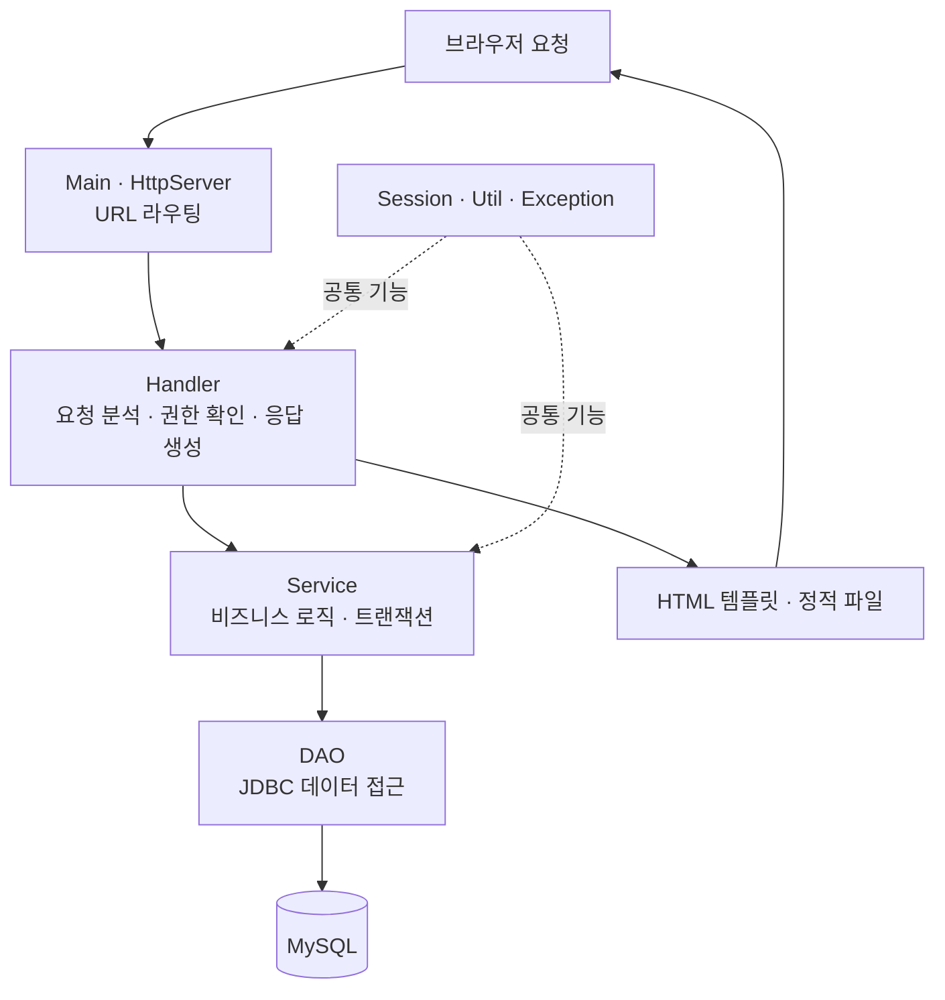

# 스터디룸 예약 관리 시스템

일반 회원의 스터디룸 조회·예약·취소·환불 요청과 관리자의 회원·스터디룸·예약·환불 관리를 구현한 팀 프로젝트입니다.

Java 내장 `HttpServer`를 기반으로 간단한 WAS 구조를 직접 구성하고, Handler–Service–DAO 계층과 JDBC·MySQL을 이용해 기능을 구현했습니다.  
단순 CRUD를 넘어 권한 분리, 데이터 소유권 검사, 트랜잭션, 비관적 락을 이용한 동시 예약 제어를 주요 과제로 다뤘습니다.


## 프로젝트 정보

- 개발 기간: 2026.09.11 ~ 2026.09.16
- 개발 인원: 3명

### 팀 구성

| 이름 | 역할 | GitHub |
| --- | --- | --- |
| 이희백 | 팀장 및 개발자 | [heebaek200](https://github.com/heebaek200) |
| 이용희 | 개발자 | [leeyonghee030](https://github.com/leeyonghee030) |
| 김도현 | 개발자 | [Sonice-lab](https://github.com/Sonice-lab) |

## 프레임워크 없이 구현한 Java 웹 애플리케이션 서버

Spring과 같은 웹 프레임워크에 의존하지 않고, 순수 Java와 JDK 내장 `HttpServer`를 기반으로 WAS의 핵심 동작을 직접 구현했습니다.

HTTP 요청·응답 처리와 URL 라우팅부터 세션 기반 인증·권한 검사, 정적 파일 및 HTML 제공, JDBC를 이용한 데이터베이스 연동과 트랜잭션·동시성 제어까지 웹 애플리케이션의 전체 흐름을 직접 설계하고 연결했습니다. 이를 통해 프레임워크가 자동으로 처리하는 웹 서버 내부 구조와 요청 처리 과정을 구체적으로 이해하는 데 중점을 두었습니다.


## 실행 화면

| 로그인 화면 | 스터디룸 목록 화면 |
| --- | --- |
| [](docs/images/1로그인%20화면.png) | [](docs/images/2스터디룸%20목록%20화면.png) |

| 예약 신청 화면 | 관리자 화면 |
| --- | --- |
| [](docs/images/3스터디룸%20예약%20신청%20화면.png) | [](docs/images/4관리자%20화면.png) |

## 기술 스택

| 구분 | 사용 기술 |
| --- | --- |
| Language | Java 21 |
| Web Server | JDK `HttpServer` |
| View | HTML, CSS |
| Database | MySQL 8, JDBC, MySQL Connector/J 8.4.0 |
| Connection Pool | HikariCP 5.1.0 |
| Security | BCrypt 0.4 |
| Data Processing | Gson 2.13.2 |
| Logging | SLF4J 2.0.17 |
| Build & Test | Gradle, JUnit 6 |
| Collaboration | GitHub Issues, Projects, Wiki, Pull Requests |

## 프로젝트 구조

```text
src/main
├─ java/com/studyroom/reservation
│  ├─ Main.java       # HttpServer 생성 및 URL 라우터 등록
│  ├─ handler/        # HTTP 요청·응답 및 화면 처리
│  ├─ service/        # 비즈니스 로직과 트랜잭션 처리
│  ├─ dao/            # JDBC를 이용한 데이터베이스 접근
│  ├─ dto/            # 계층 간 데이터 전달 객체
│  ├─ enums/          # 상태 및 권한 상수
│  ├─ session/        # 로그인 세션 관리
│  ├─ exception/      # 비즈니스 예외
│  └─ util/           # DB 연결, HTTP 응답, 암호화 공통 기능
│
└─ resources
   ├─ templates/      # HTML 화면 템플릿
   ├─ static/         # CSS 등 정적 파일
   └─ db/             # 데이터베이스 관련 리소스
```

### 요청 처리 흐름



브라우저에서 전달된 요청은 `Main`에 등록된 URL에 따라 각 `Handler`로 분배됩니다. `Handler`는 요청값과 사용자 권한을 확인하고, `Service`는 비즈니스 규칙과 트랜잭션을 처리합니다. 이후 `DAO`가 JDBC를 통해 MySQL에 접근하며, 처리 결과는 HTML 또는 HTTP 응답으로 다시 사용자에게 전달됩니다.

## 주요 기능

### 일반 회원

- 회원가입·로그인·로그아웃
- 회원 정보 조회·수정·탈퇴
- 스터디룸 목록·상세 조회
- 예약 신청·목록·상세 조회
- 예약 취소와 환불 요청
- 본인 환불 내역 조회

### 관리자

- 회원 조회와 강제 탈퇴
- 스터디룸 등록·수정
- 전체 예약 조회
- 환불 요청 조회·승인·거절

## 핵심 문제 해결

### 동일 시간대 중복 예약 방지

여러 사용자가 같은 스터디룸과 시간대를 동시에 예약하면, 단순히 중복 여부를 조회한 뒤 예약을 저장하는 방식에서는 두 요청이 모두 검사를 통과하는 경쟁 상태가 발생할 수 있습니다.

예약 생성 로직에 트랜잭션과 `SELECT ... FOR UPDATE`를 적용하여 대상 데이터를 잠그고, 중복 예약 확인과 저장이 하나의 작업 단위로 처리되도록 구현했습니다. 같은 스터디룸과 시간대에 8건의 예약을 동시에 요청한 통합 테스트에서는 1건만 성공하는 것을 확인했습니다.

## 실행 방법

### 사전 준비

- JDK 21
- MySQL 8
- Gradle을 사용할 수 있는 Java 개발 환경
- `study_room_reservation` 데이터베이스와 필요한 테이블

테이블 구조와 상태값은 [데이터베이스 설계서 및 ERD](https://github.com/heebaek200/study_room_reservation/wiki/데이터베이스-설계서-및-ERD)에서 확인할 수 있습니다.

### 환경변수

| 이름 | 설명 |
| --- | --- |
| `DB_HOST_STUDY_ROOM_RESERVATION` | MySQL 서버 주소 |
| `DB_USER_STUDY_ROOM_RESERVATION` | DB 사용자명 |
| `DB_PASSWORD_STUDY_ROOM_RESERVATION` | DB 비밀번호 |

MySQL 포트는 `3306`, 데이터베이스 이름은 `study_room_reservation`을 사용합니다.

### 빌드

Windows PowerShell:

```powershell
.\gradlew.bat clean classes
```

macOS 또는 Linux:

```bash
./gradlew clean classes
```

### 실행

1. 저장소를 Clone하고 프로젝트를 Java IDE에서 엽니다.
2. 위의 환경변수를 실행 설정에 등록합니다.
3. `com.studyroom.reservation.Main`을 실행합니다.
4. 브라우저에서 `http://localhost:8080`에 접속합니다.

## 프로젝트 관리

| 구분 | 링크 |
| --- | --- |
| 프로젝트 보드 | [GitHub Projects](https://github.com/users/heebaek200/projects/5) |
| Issue 목록 | [GitHub Issues](https://github.com/heebaek200/study_room_reservation/issues) |
| Pull Request 목록 | [Pull Requests](https://github.com/heebaek200/study_room_reservation/pulls) |
| 전체 Wiki | [프로젝트 Wiki](https://github.com/heebaek200/study_room_reservation/wiki) |
| 프로젝트 소개 | [스터디룸 예약 관리 시스템 프로젝트 소개](https://github.com/heebaek200/study_room_reservation/wiki/스터디룸-예약-관리-시스템-프로젝트-소개) |

## 설계 문서

| 문서 | 설명 |
| --- | --- |
| [최초 설계](https://github.com/heebaek200/study_room_reservation/wiki/최초-설계) | 프로젝트 시작 단계의 기능과 구조 |
| [요구사항 명세서](https://github.com/heebaek200/study_room_reservation/wiki/요구사항-명세서) | 기능·제약사항·완료 기준 |
| [권한별 기능 매트릭스](https://github.com/heebaek200/study_room_reservation/wiki/권한별-기능-매트릭스) | 비회원·일반 회원·관리자별 접근 범위 |
| [데이터베이스 설계서 및 ERD](https://github.com/heebaek200/study_room_reservation/wiki/데이터베이스-설계서-및-ERD) | 테이블, 관계, 상태값과 데이터 보존 정책 |
| [사용자 시나리오 및 업무 규칙](https://github.com/heebaek200/study_room_reservation/wiki/사용자-시나리오-및-업무-규칙) | 정상·예외 흐름과 업무 규칙 |
| [화면 설계서](https://github.com/heebaek200/study_room_reservation/wiki/화면-설계서) | 사용자·관리자 화면 구성 |
| [주요 기능 클래스 다이어그램](https://github.com/heebaek200/study_room_reservation/wiki/주요-기능-클래스-다이어그램) | Handler·Service·DAO 관계 |
| [작업 분담 및 Issue 목록](https://github.com/heebaek200/study_room_reservation/wiki/작업-분담-및-Issue-목록) | 기능별 담당 영역과 Issue 구성 |

## 협업 문서

| 문서 | 설명 |
| --- | --- |
| [GitHub Projects 도입](https://github.com/heebaek200/study_room_reservation/wiki/GitHub-Projects-도입) | 프로젝트 관리 도구와 상태 관리 방법 |
| [작업 순서](https://github.com/heebaek200/study_room_reservation/wiki/작업-순서) | Issue 확인부터 브랜치·PR·병합까지의 절차 |
| [Git 문제 해결](https://github.com/heebaek200/study_room_reservation/wiki/Git-문제-해결) | 작업 중 발생할 수 있는 Git 문제 대응 방법 |

## 주요 기술적 고려사항

- BCrypt를 이용한 비밀번호 해시 저장
- 비회원·일반 회원·관리자 권한 분리
- 회원 탈퇴 시 상태를 변경하는 논리 삭제
- 예약 생성·취소·환불 처리의 트랜잭션 적용
- `SELECT ... FOR UPDATE`를 이용한 비관적 락
- 동일 스터디룸·시간대의 동시 예약 방지
- 사용자 입력값 HTML escape
- 환경변수를 이용한 DB 접속 정보 관리
- GitHub Issues·Projects·Pull Requests를 이용한 협업 및 코드 리뷰

## 테스트

권한, 데이터 소유권, 예약 시간 경계값, 중복 예약, 동시 예약, 예약 취소·환불 트랜잭션을 중심으로 통합 테스트를 진행했습니다.

- [통합 테스트 Issue #12](https://github.com/heebaek200/study_room_reservation/issues/12)

## 향후 개선 방향

- 세션 만료 정책 적용
- 요청 및 오류 로그 체계화
- 입력값 검증과 오류 응답 처리 공통화
- 데이터베이스 스키마와 초기 데이터 구성 자동화
- 통합 테스트의 자동 실행 환경 구성
